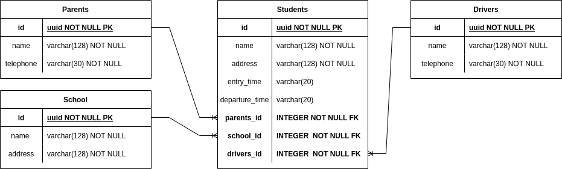

# Documentação da API

## Tabela de Conteúdos

- [Visão Geral](#1-visão-geral)
- [Diagrama ER](#2-diagrama-er)
- [Início Rápido](#3-início-rápido)
  - [Instalando Dependências](#31-instalando-dependências)
  - [Variáveis de Ambiente](#32-variáveis-de-ambiente)
  - [Migrations](#33-migrations)
- [Autenticação](#4-autenticação)
- [Endpoints](#5-endpoints)

---

## 1. Visão Geral

Visão geral do projeto, um pouco das tecnologias usadas.

- [NodeJS](https://nodejs.org/en/)
- [Express](https://expressjs.com/pt-br/)
- [TypeScript](https://www.typescriptlang.org/)
- [PostgreSQL](https://www.postgresql.org/)
- [TypeORM](https://typeorm.io/)
- [UUID](https://www.npmjs.com/package/uuid)

A URL base da aplicação:

https://facilita-transporte.herokuapp.com

---

## 2. Diagrama ER

[ Voltar para o topo ](#tabela-de-conteúdos)



---

## 3. Início Rápido

[ Voltar para o topo ](#tabela-de-conteúdos)

### 3.1. Instalando Dependências

Clone o projeto em sua máquina e instale as dependências com o comando:

```shell
yarn
```

### 3.2. Variáveis de Ambiente

Em seguida, crie um arquivo **.env**, copiando o formato do arquivo **.env.example**:

```
cp .env.example .env
```

Configure suas variáveis de ambiente com suas credenciais do Postgres e uma nova database da sua escolha.

### 3.3. Migrations

Execute as migrations com o comando:

```
yarn typeorm migration:run -d src/data-source.ts
```

---

## 4. Autenticação

[ Voltar para o topo ](#tabela-de-conteúdos)

Por enquanto, não foi implementada autenticação.

---

## 5. Endpoints

[ Voltar para o topo ](#tabela-de-conteúdos)

### Índice

- [Drivers](#1-drivers)
  - [POST - /drivers](#11-drivers-criation)
  - [GET - /drivers](#12-drivers-list)
  - [GET - /drivers/:driver_id](#13-list-driver-with-id)
  - [PATCH - /drivers/:driver_id](#14-update-driver-with-id)
  - [DELETE - /drivers/:driver_id](#15-delete-driver-with-id)
- [Student](#2-studant)
  - [POST - /students](#21-students-criation)
  - [GET - /students](#22-students-list)
  - [GET - /students/:student_id](#23-student-list-whit-id)
  - [PATCH - /students/:student_id](#24-update-student-with-id)
  - [DELETE - /students/:student_id](#25-delete-student-with-id)
- [Parents](#3-parent)
  - [POST - /parents](#21-parents-criation)
  - [GET - /parents](#22-parents-list)
  - [GET - /parents/:parent_id](#23-parent-list-whit-id)
  - [PATCH - /parents/:parent_id](#24-update-parent-with-id)
  - [DELETE - /parents/:parent_id](#25-delete-parent-with-id)
- [Schools](#4-schools)
  - [POST - /schools](#21-schools-criation)
  - [GET - /schools](#22-schools-list)
  - [GET - /schools/:school_id](#23-school-list-whit-id)
  - [PATCH - /schools/:school_id](#24-update-school-with-id)
  - [DELETE - /schools/:school_id](#25-delete-school-with-id)

---

## 1. **Drivers**

[ Voltar para os Endpoints ](#5-endpoints)

O objeto Drivers é definido como:

| Campo       | Tipo    | Descrição                        |
| ----------- | ------- | -------------------------------- |
| id          | string  | Identificador único do motorista |
| name        | string  | O nome do motorista              |
| telephone   | string  | O endereço do motorista          |
| students_id | integer | Os ids das crianças              |

### Endpoints

| Método | Rota                | Descrição                                       |
| ------ | ------------------- | ----------------------------------------------- |
| POST   | /drivers            | Criação de um motorista                         |
| GET    | /drivers            | Lista todos os motoristas                       |
| GET    | /drivers/:driver_id | Lista um motorista usando seu ID como parâmetro |
| PATCH  | /drivers/:driver_id | Atualiza os dados de um motorista pelo ID       |
| DELETE | /drivers/:driver_id | Deleta um motorista do banco de dados pelo ID   |

---

### 1.1. **Criação de Motorista**

[ Voltar para os Endpoints ](#5-endpoints)

### `/drivers`

### Exemplo de Request:

```
POST /drivers
Host: http://suaapi.com/v1
Authorization: None
Content-type: application/json
```

### Corpo da Requisição:

```json
{
  "name": "Magno",
  "telephone": "(12)12345-6789"
}
```

### Schema de Validação com Yup:

```javascript
name: yup
        .string()
	.required()
	.transform((value, originalValue) => {
		return titlelify(originalValue)
	}),
telephone: yup
        .string()
	.required()
	.transform((value, originalValue) => {
		return originalValue.toLowerCase()
	}),
```

### Exemplo de Response:

```
201 Created
```

```json
{
  "id": "9cda28c9-e540-4b2c-bf0c-c90006d37893",
  "name": "Magno",
  "telephone": "(12)12345-6789"
}
```

### Possíveis Erros:

| Código do Erro | Descrição                     |
| -------------- | ----------------------------- |
| 409 Conflict   | Telephone already registered. |

---

### 1.2. **Listando Motoristas**

[ Voltar aos Endpoints ](#5-endpoints)

### `/drivers`

### Exemplo de Request:

```
GET /drivers
Host: http://suaapi.com/v1
Authorization: None
Content-type: application/json
```

### Corpo da Requisição:

```json
Vazio
```

### Exemplo de Response:

```
200 OK
```

```json
[
  {
    "id": "9cda28c9-e540-4b2c-bf0c-c90006d37893",
    "name": "Magno",
    "telephone": "(12)12345-6789"
  }
]
```

### Possíveis Erros:

Nenhum, o máximo que pode acontecer é retornar uma lista vazia.

---

### 1.3. **Listar Motorista por ID**

[ Voltar aos Endpoints ](#5-endpoints)

### `/drivers/:driver_id`

### Exemplo de Request:

```
GET /drivers/9cda28c9-e540-4b2c-bf0c-c90006d37893
Host: http://suaapi.com/v1
Authorization: None
Content-type: application/json
```

### Parâmetros da Requisição:

| Parâmetro | Tipo   | Descrição                                 |
| --------- | ------ | ----------------------------------------- |
| driver_id | string | Identificador único do motorista (Driver) |

### Corpo da Requisição:

```json
Vazio
```

### Exemplo de Response:

```
200 OK
```

```json
{
  "id": "9cda28c9-e540-4b2c-bf0c-c90006d37893",
  "name": "Magno",
  "telephone": "(12)12345-6789"
}
```

### Possíveis Erros:

| Código do Erro | Descrição       |
| -------------- | --------------- |
| 404 Not Found  | User not found. |

---

### 1.4. **Atualizar Motorista por ID**

[ Voltar aos Endpoints ](#5-endpoints)

### `/drivers/:driver_id`

### Exemplo de Request:

```
PATCH /drivers/9cda28c9-e540-4b2c-bf0c-c90006d37893
Host: http://suaapi.com/v1
Authorization: None
Content-type: application/json
```

### Parâmetros da Requisição:

| Parâmetro | Tipo   | Descrição                                 |
| --------- | ------ | ----------------------------------------- |
| driver_id | string | Identificador único do motorista (Driver) |

### Corpo da Requisição:

```json
{
  "name": "Magno Silva",
  "telephone": "(12)12345-6780"
}
```

### Exemplo de Response:

```
200 OK
```

```json
{
  "id": "9cda28c9-e540-4b2c-bf0c-c90006d37893",
  "name": "Magno Silva",
  "telephone": "(12)12345-6780"
}
```

### Possíveis Erros:

| Código do Erro | Descrição       |
| -------------- | --------------- |
| 404 Not Found  | User not found. |

---

### 1.5. **Deletar Motorista por ID**

[ Voltar aos Endpoints ](#5-endpoints)

### `/drivers/:driver_id`

### Exemplo de Request:

```
DELETE /drivers/9cda28c9-e540-4b2c-bf0c-c90006d37893
Host: http://suaapi.com/v1
Authorization: None
Content-type: application/json
```

### Parâmetros da Requisição:

| Parâmetro | Tipo   | Descrição                                 |
| --------- | ------ | ----------------------------------------- |
| driver_id | string | Identificador único do motorista (Driver) |

### Corpo da Requisição:

```json
VAZIO
```

### Exemplo de Response:

```
200 OK
```

```json
{
  "message": "Driver Deleted"
}
```

### Possíveis Erros:

| Código do Erro | Descrição         |
| -------------- | ----------------- |
| 404 Not Found  | Driver not found. |

---

## 2. **Students**

[ Voltar para os Endpoints ](#5-endpoints)

O objeto students é definido como:

| Campo          | Tipo   | Descrição                                   |
| -------------- | ------ | ------------------------------------------- |
| id             | string | Identificador único do estudante            |
| name           | string | O nome do estudante                         |
| telephone      | string | O endereço do estudante                     |
| entry_time     | string | O horario de entrada do estudante na escola |
| departure_time | string | O horario de saida do estudante da escola   |

### Endpoints

| Método | Rota                  | Descrição                                       |
| ------ | --------------------- | ----------------------------------------------- |
| POST   | /students             | Criação de um estudante                         |
| GET    | /students             | Lista todos os estudantes                       |
| GET    | /students/:student_id | Lista um estudante usando seu ID como parâmetro |
| PATCH  | /students/:student_id | Atualiza os dados de um estudante pelo ID       |
| DELETE | /students/:student_id | Deleta um estudante do banco de dados pelo ID   |

---

### 2.1. **Criação de Estudante**

[ Voltar para os Endpoints ](#5-endpoints)

### `/students`

### Exemplo de Request:

```
POST /students
Host: http://suaapi.com/v1
Authorization: None
Content-type: application/json
```

### Corpo da Requisição:

```json
{
  "name": "Magno",
  "adress": "Rua Engenheiro Magno de Carvalho, Guadalupe - 50",
  "entry_time": "12:00 pm",
  "departure_time": "17:00 pm",
  "parents_id": "9cda28c9-e540-4b2c-bf0c-c90006d37893",
  "school_id": "9cda28c9-e540-4b2c-bf0c-c90006d37893",
  "drivers_id": "9cda28c9-e540-4b2c-bf0c-c90006d37893"
}
```

### Schema de Validação com Yup:

```javascript
name: yup
        .string()
	.required()
	.transform((value, originalValue) => {
		return titlelify(originalValue)
	}),
adress: yup
        .string()
	.required()
	.transform((value, originalValue) => {
		return originalValue.toLowerCase()
	}),
entry_time: yup
        .string()
	.transform((value, originalValue) => {
		return originalValue.toLowerCase()
	}),
departure_time: yup
        .string()
	.transform((value, originalValue) => {
		return originalValue.toLowerCase()
	}),
parents_id: yup
        .string()
	.required()
	.transform((value, originalValue) => {
		return originalValue.toLowerCase()
	}),
school_id: yup
        .string()
	.required()
	.transform((value, originalValue) => {
		return originalValue.toLowerCase()
	}),
drivers_id: yup
        .string()
	.required()
	.transform((value, originalValue) => {
		return originalValue.toLowerCase()
	}),
```

### Exemplo de Response:

```
201 Created
```

```json
{
  "id": "9cda28c9-e540-4b2c-bf0c-c90006d37893",
  "name": "Magno",
  "adress": "Rua Engenheiro Magno de Carvalho, Guadalupe - 50",
  "entry_time": "12:00 pm",
  "departure_time": "17:00 pm",
  "parents_id": "9cda28c9-e540-4b2c-bf0c-c90006d37893",
  "school_id": "9cda28c9-e540-4b2c-bf0c-c90006d37893",
  "drivers_id": "9cda28c9-e540-4b2c-bf0c-c90006d37893"
}
```

### Possíveis Erros:

Nenhum

---

### 2.2. **Listando Estudantes**

[ Voltar aos Endpoints ](#5-endpoints)

### `/students`

### Exemplo de Request:

```
GET /students
Host: http://suaapi.com/v1
Authorization: None
Content-type: application/json
```

### Corpo da Requisição:

```json
Vazio
```

### Exemplo de Response:

```
200 OK
```

```json
[
  {
    "id": "9cda28c9-e540-4b2c-bf0c-c90006d37893",
    "name": "Magno",
    "adress": "Rua Engenheiro Magno de Carvalho, Guadalupe - 50",
    "entry_time": "12:00 pm",
    "departure_time": "17:00 pm",
    "parents_id": "9cda28c9-e540-4b2c-bf0c-c90006d37893",
    "school_id": "9cda28c9-e540-4b2c-bf0c-c90006d37893",
    "drivers_id": "9cda28c9-e540-4b2c-bf0c-c90006d37893"
  }
]
```

### Possíveis Erros:

Nenhum, o máximo que pode acontecer é retornar uma lista vazia.

---

### 2.3. **Listar Estudante por ID**

[ Voltar aos Endpoints ](#5-endpoints)

### `/students/:student_id`

### Exemplo de Request:

```
GET /students/9cda28c9-e540-4b2c-bf0c-c90006d37893
Host: http://suaapi.com/v1
Authorization: None
Content-type: application/json
```

### Parâmetros da Requisição:

| Parâmetro  | Tipo   | Descrição                                  |
| ---------- | ------ | ------------------------------------------ |
| student_id | string | Identificador único do estudante (Student) |

### Corpo da Requisição:

```json
Vazio
```

### Exemplo de Response:

```
200 OK
```

```json
{
  "id": "9cda28c9-e540-4b2c-bf0c-c90006d37893",
  "name": "Magno",
  "adress": "Rua Engenheiro Magno de Carvalho, Guadalupe - 50",
  "entry_time": "12:00 pm",
  "departure_time": "17:00 pm",
  "parents_id": "9cda28c9-e540-4b2c-bf0c-c90006d37893",
  "school_id": "9cda28c9-e540-4b2c-bf0c-c90006d37893",
  "drivers_id": "9cda28c9-e540-4b2c-bf0c-c90006d37893"
}
```

### Possíveis Erros:

| Código do Erro | Descrição          |
| -------------- | ------------------ |
| 404 Not Found  | Student not found. |

---

### 2.4. **Atualizar Estudante por ID**

[ Voltar aos Endpoints ](#5-endpoints)

### `/students/:student_id`

### Exemplo de Request:

```
PATCH /students/9cda28c9-e540-4b2c-bf0c-c90006d37893
Host: http://suaapi.com/v1
Authorization: None
Content-type: application/json
```

### Parâmetros da Requisição:

| Parâmetro  | Tipo   | Descrição                                  |
| ---------- | ------ | ------------------------------------------ |
| student_id | string | Identificador único do estudante (Student) |

### Corpo da Requisição:

```json
{
  "name": "Magno Silva",
  "adress": "Estrada Engenheiro Magno de Carvalho, Guadalupe - 50",
  "entry_time": "7:00 am",
  "departure_time": "11:45 am",
  "parents_id": "39873d60009c-c0fb-c2b4-045e-9c82adc9",
  "school_id": "39873d60009c-c0fb-c2b4-045e-9c82adc9",
  "drivers_id": "39873d60009c-c0fb-c2b4-045e-9c82adc9"
}
```

### Exemplo de Response:

```
200 OK
```

```json
{
  "id": "9cda28c9-e540-4b2c-bf0c-c90006d37893",
  "name": "Magno Silva",
  "adress": "Estrada Engenheiro Magno de Carvalho, Guadalupe - 50",
  "entry_time": "7:00 am",
  "departure_time": "11:45 am",
  "parents_id": "39873d60009c-c0fb-c2b4-045e-9c82adc9",
  "school_id": "39873d60009c-c0fb-c2b4-045e-9c82adc9",
  "drivers_id": "39873d60009c-c0fb-c2b4-045e-9c82adc9"
}
```

### Possíveis Erros:

| Código do Erro | Descrição          |
| -------------- | ------------------ |
| 404 Not Found  | Student not found. |

---

### 2.5. **Deletar Estudante por ID**

[ Voltar aos Endpoints ](#5-endpoints)

### `/students/:student_id`

### Exemplo de Request:

```
DELETE /students/9cda28c9-e540-4b2c-bf0c-c90006d37893
Host: http://suaapi.com/v1
Authorization: None
Content-type: application/json
```

### Parâmetros da Requisição:

| Parâmetro  | Tipo   | Descrição                                  |
| ---------- | ------ | ------------------------------------------ |
| student_id | string | Identificador único do estudante (Student) |

### Corpo da Requisição:

```json
VAZIO
```

### Exemplo de Response:

```
200 OK
```

```json
{
  "message": "Student Deleted"
}
```

### Possíveis Erros:

| Código do Erro | Descrição          |
| -------------- | ------------------ |
| 404 Not Found  | Student not found. |

---

## 3. **Parentes**

[ Voltar para os Endpoints ](#5-endpoints)

O objeto students é definido como:

| Campo     | Tipo   | Descrição                      |
| --------- | ------ | ------------------------------ |
| id        | string | Identificador único do Parente |
| name      | string | O nome do Parente              |
| telephone | string | O telefone do Parente          |

### Endpoints

| Método | Rota                | Descrição                                    |
| ------ | ------------------- | -------------------------------------------- |
| POST   | /parents            | Criação de um Parente                        |
| GET    | /parents            | Lista todos os Parentes                      |
| GET    | /parents/:parent_id | Lista um Parent usando seu ID como parâmetro |
| PATCH  | /parents/:parent_id | Atualiza os dados de um Parente pelo ID      |
| DELETE | /parents/:parent_id | Deleta um Parente do banco de dados pelo ID  |

---

### 3.1. **Criação de Parente**

[ Voltar para os Endpoints ](#5-endpoints)

### `/parents`

### Exemplo de Request:

```
POST /parents
Host: http://suaapi.com/v1
Authorization: None
Content-type: application/json
```

### Corpo da Requisição:

```json
{
  "name": "Magno",
  "telephone": "(21)99898-0990"
}
```

### Schema de Validação com Yup:

```javascript
name: yup
        .string()
	.required()
	.transform((value, originalValue) => {
		return titlelify(originalValue)
	}),
telephone: yup
        .string()
	.required()
	.transform((value, originalValue) => {
		return originalValue.toLowerCase()
	}),

```

### Exemplo de Response:

```
201 Created
```

```json
{
  "id": "9cda28c9-e540-4b2c-bf0c-c90006d37893",
  "name": "Magno",
  "telephone": "(21)99898-0990"
}
```

### Possíveis Erros:

Nenhum

---

### 3.2. **Listando Parentes**

[ Voltar aos Endpoints ](#5-endpoints)

### `/parents`

### Exemplo de Request:

```
GET /parents
Host: http://suaapi.com/v1
Authorization: None
Content-type: application/json
```

### Corpo da Requisição:

```json
Vazio
```

### Exemplo de Response:

```
200 OK
```

```json
[
  {
    "id": "9cda28c9-e540-4b2c-bf0c-c90006d37893",
    "name": "Magno",
    "telephone": "(21)99898-0990"
  }
]
```

### Possíveis Erros:

Nenhum, o máximo que pode acontecer é retornar uma lista vazia.

---

### 3.3. **Listar Parente por ID**

[ Voltar aos Endpoints ](#5-endpoints)

### `/parents/:parent_id`

### Exemplo de Request:

```
GET /parents/9cda28c9-e540-4b2c-bf0c-c90006d37893
Host: http://suaapi.com/v1
Authorization: None
Content-type: application/json
```

### Parâmetros da Requisição:

| Parâmetro | Tipo   | Descrição                               |
| --------- | ------ | --------------------------------------- |
| parent_id | string | Identificador único do parente (Parent) |

### Corpo da Requisição:

```json
Vazio
```

### Exemplo de Response:

```
200 OK
```

```json
{
  "id": "9cda28c9-e540-4b2c-bf0c-c90006d37893",
  "name": "Magno",
  "telephone": "(21)99898-0990"
}
```

### Possíveis Erros:

| Código do Erro | Descrição         |
| -------------- | ----------------- |
| 404 Not Found  | Parent not found. |

---

### 3.4. **Atualizar Parent por ID**

[ Voltar aos Endpoints ](#5-endpoints)

### `/parents/:parent_id`

### Exemplo de Request:

```
PATCH /parents/9cda28c9-e540-4b2c-bf0c-c90006d37893
Host: http://suaapi.com/v1
Authorization: None
Content-type: application/json
```

### Parâmetros da Requisição:

| Parâmetro | Tipo   | Descrição                               |
| --------- | ------ | --------------------------------------- |
| parent_id | string | Identificador único do parente (Parent) |

### Corpo da Requisição:

```json
{
  "name": "Magno da Silva",
  "telephone": "(21)99898-1111"
}
```

### Exemplo de Response:

```
200 OK
```

```json
{
  "id": "9cda28c9-e540-4b2c-bf0c-c90006d37893",
  "name": "Magno da Silva",
  "telephone": "(21)99898-1111"
}
```

### Possíveis Erros:

| Código do Erro | Descrição         |
| -------------- | ----------------- |
| 404 Not Found  | Parent not found. |

---

### 3.5. **Deletar Parente por ID**

[ Voltar aos Endpoints ](#5-endpoints)

### `/parents/:parent_id`

### Exemplo de Request:

```
DELETE /parents/9cda28c9-e540-4b2c-bf0c-c90006d37893
Host: http://suaapi.com/v1
Authorization: None
Content-type: application/json
```

### Parâmetros da Requisição:

| Parâmetro | Tipo   | Descrição                               |
| --------- | ------ | --------------------------------------- |
| parent_id | string | Identificador único do parente (Parent) |

### Corpo da Requisição:

```json
VAZIO
```

### Exemplo de Response:

```
200 OK
```

```json
{
  "message": "Parent Deleted"
}
```

### Possíveis Erros:

| Código do Erro | Descrição         |
| -------------- | ----------------- |
| 404 Not Found  | Parent not found. |

## 4. **Schools**

[ Voltar para os Endpoints ](#5-endpoints)

O objeto schools é definido como:

| Campo  | Tipo   | Descrição                     |
| ------ | ------ | ----------------------------- |
| id     | string | Identificador único da escola |
| name   | string | O nome da escola              |
| adress | string | O endereço da escola          |

### Endpoints

| Método | Rota                | Descrição                                    |
| ------ | ------------------- | -------------------------------------------- |
| POST   | /schools            | Criação de um school                         |
| GET    | /schools            | Lista todos os schools                       |
| GET    | /schools/:school_id | Lista um school usando seu ID como parâmetro |
| PATCH  | /schools/:user_id   | Atualiza os dados de um school pelo ID       |
| DELETE | /schools/:user_id   | Deleta um school do banco de dados pelo ID   |

---

### 4.1. **Criação de Escola**

[ Voltar para os Endpoints ](#5-endpoints)

### `/schools`

### Exemplo de Request:

```
POST /schools
Host: http://suaapi.com/v1
Authorization: None
Content-type: application/json
```

### Corpo da Requisição:

```json
{
  "name": "Centro Educacional Magno",
  "adress": "Rua Engenheiro Magno de Carvalho, Guadalupe - 50"
}
```

### Schema de Validação com Yup:

```javascript
name: yup
        .string()
	.required()
	.transform((value, originalValue) => {
		return titlelify(originalValue)
	}),
adress: yup
        .string()
	.required()
	.transform((value, originalValue) => {
		return originalValue.toLowerCase()
	}),

```

### Exemplo de Response:

```
201 Created
```

```json
{
  "id": "9cda28c9-e540-4b2c-bf0c-c90006d37893",
  "name": "Centro Educacional Magno",
  "adress": "Rua Engenheiro Magno de Carvalho, Guadalupe - 50"
}
```

### Possíveis Erros:

Nenhum

---

### 4.2. **Listando Escolas**

[ Voltar aos Endpoints ](#5-endpoints)

### `/schools`

### Exemplo de Request:

```
GET /schools
Host: http://suaapi.com/v1
Authorization: None
Content-type: application/json
```

### Corpo da Requisição:

```json
Vazio
```

### Exemplo de Response:

```
200 OK
```

```json
[
  {
    "id": "9cda28c9-e540-4b2c-bf0c-c90006d37893",
    "name": "Centro Educacional Magno",
    "adress": "Rua Engenheiro Magno de Carvalho, Guadalupe - 50"
  }
]
```

### Possíveis Erros:

Nenhum, o máximo que pode acontecer é retornar uma lista vazia.

---

### 4.3. **Listar Escola por ID**

[ Voltar aos Endpoints ](#5-endpoints)

### `/schools/:school_id`

### Exemplo de Request:

```
GET /schools/9cda28c9-e540-4b2c-bf0c-c90006d37893
Host: http://suaapi.com/v1
Authorization: None
Content-type: application/json
```

### Parâmetros da Requisição:

| Parâmetro | Tipo   | Descrição                              |
| --------- | ------ | -------------------------------------- |
| school_id | string | Identificador único da escola (School) |

### Corpo da Requisição:

```json
Vazio
```

### Exemplo de Response:

```
200 OK
```

```json
{
  "id": "9cda28c9-e540-4b2c-bf0c-c90006d37893",
  "name": "Centro Educacional Magno",
  "adress": "Rua Engenheiro Magno de Carvalho, Guadalupe - 50"
}
```

### Possíveis Erros:

| Código do Erro | Descrição         |
| -------------- | ----------------- |
| 404 Not Found  | School not found. |

---

### 4.4. **Atualizar Escola por ID**

[ Voltar aos Endpoints ](#5-endpoints)

### `/schools/:school_id`

### Exemplo de Request:

```
PATCH /schools/9cda28c9-e540-4b2c-bf0c-c90006d37893
Host: http://suaapi.com/v1
Authorization: None
Content-type: application/json
```

### Parâmetros da Requisição:

| Parâmetro | Tipo   | Descrição                              |
| --------- | ------ | -------------------------------------- |
| school_id | string | Identificador único da escola (School) |

### Corpo da Requisição:

```json
{
  "name": "Centro Educacional Magno da Silva",
  "adress": "Rua Engenheiro Magno de Carvalho, Guadalupe - 2"
}
```

### Exemplo de Response:

```
200 OK
```

```json
{
  "id": "9cda28c9-e540-4b2c-bf0c-c90006d37893",
  "name": "Centro Educacional Magno da Silva",
  "adress": "Rua Engenheiro Magno de Carvalho, Guadalupe - 2"
}
```

### Possíveis Erros:

| Código do Erro | Descrição         |
| -------------- | ----------------- |
| 404 Not Found  | School not found. |

---

### 4.5. **Deletar Escola por ID**

[ Voltar aos Endpoints ](#5-endpoints)

### `/schools/:school_id`

### Exemplo de Request:

```
DELETE /schools/9cda28c9-e540-4b2c-bf0c-c90006d37893
Host: http://suaapi.com/v1
Authorization: None
Content-type: application/json
```

### Parâmetros da Requisição:

| Parâmetro | Tipo   | Descrição                              |
| --------- | ------ | -------------------------------------- |
| school_id | string | Identificador único da escola (School) |

### Corpo da Requisição:

```json
VAZIO
```

### Exemplo de Response:

```
200 OK
```

```json
{
  "message": "School Deleted"
}
```

### Possíveis Erros:

| Código do Erro | Descrição         |
| -------------- | ----------------- |
| 404 Not Found  | School not found. |
